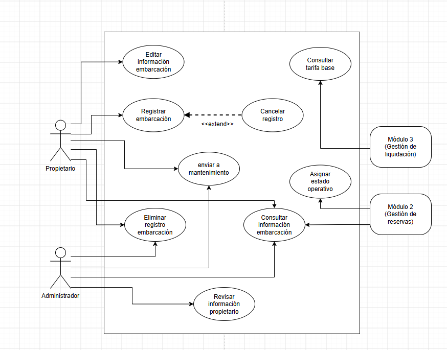

# SeaShare - Alquiler de Vehículos Fluviales

¡Bienvenido al repositorio oficial del Módulo de Gestión de Registro y Activos de **SeaShare**! Esta plataforma está diseñada para facilitar el alquiler de vehículos fluviales (lanchas, veleros, yates y catamaranes) conectando a propietarios con usuarios de forma segura y eficiente.

## Módulo de Registro y Gestión de Flota
Este módulo abarca el ciclo de vida inicial de las embarcaciones: desde su registro por parte de los propietarios, la validación de matrículas y puertos mediante mapas, hasta la gestión de sus estados operativos y la integración con los módulos de reservas y liquidación.

## Diagrama de Casos de Uso
A continuación se muestra el diagrama general de casos de uso que rige la arquitecetura y el comportamiento del sistema:

